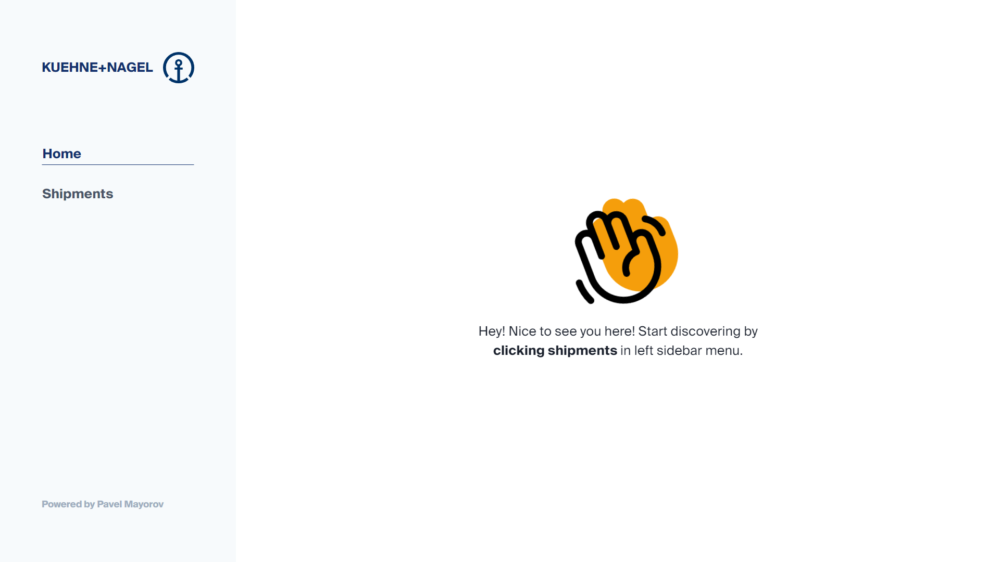
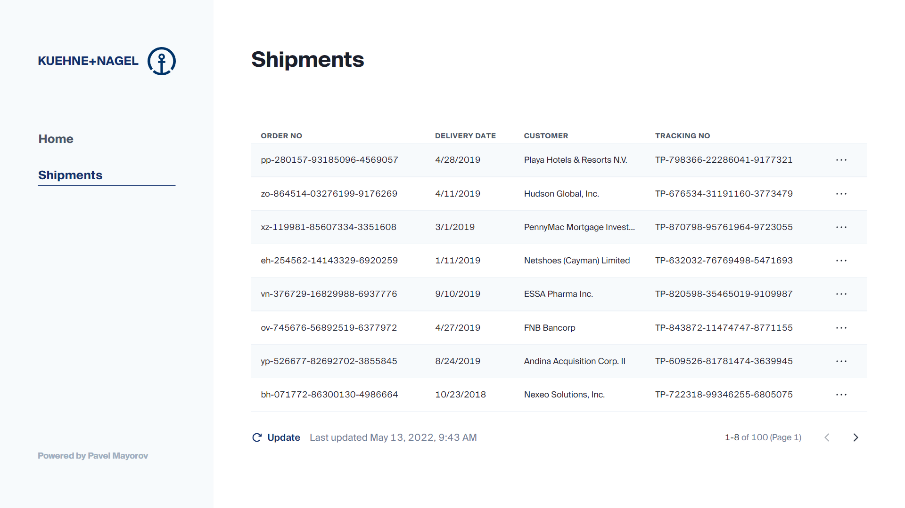
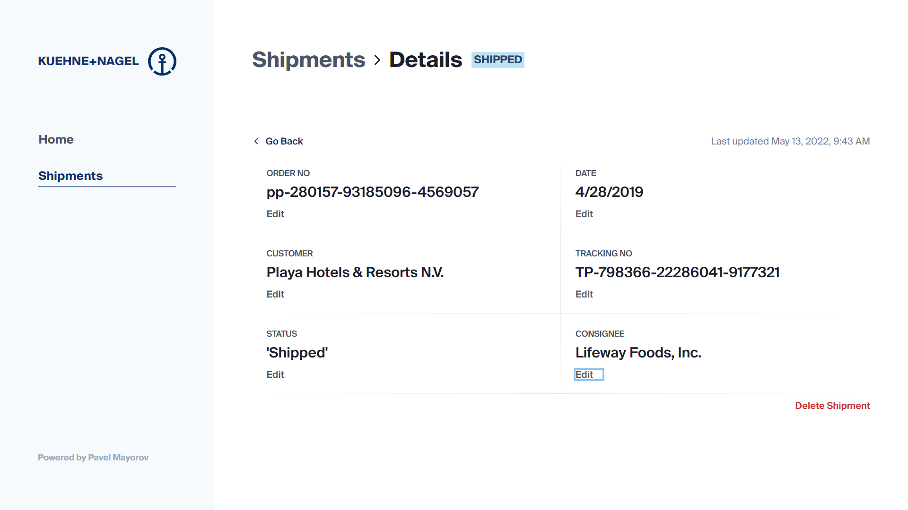

# Kuehne+Nagel Shipments Dashboard
Dashboard displaying shipments and allowing you to manipulate with them.

## Stack
The primary language is __TypeScript__. App was made using __React, Redux, React-Router, Vite__ using __Chakra UI and WindiCSS__. Consuming API using __Axios__. 

## How to reproduce
1. `npm install`
2. Copy `.env.example` file and rename it to `.env`. The file contains the link to the API. 
3. `npm run dev` - to run it on [localhost:3000](localhost:3000)
4. `npm run build` - to build it to the `dist` folder

## Screenshots

